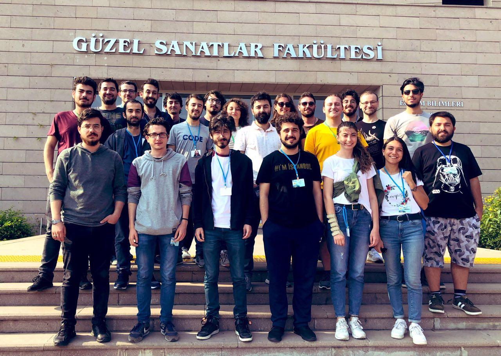
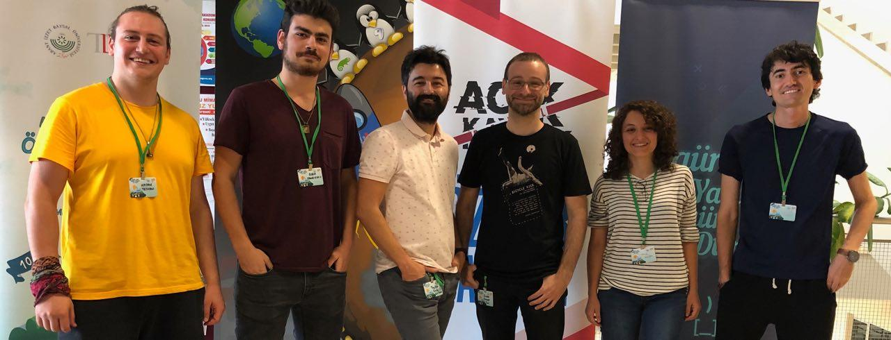

## Ruby / Rails - OYK 2019 Yaz

	Son Güncelleme : 16 Ağustos, 2019

Bu repo'nun amacı kamp sürecinde anlatımı yapılan konuları yazılı bir kaynak haline getirerek saklamaktır.  
Kamp sürecinde yazıldığı için HAM VERİ aşamasındadır. Geliştirilmesine destekte bulunmak için PR gönderebilirsiniz.

Kurs organizasyonu: [**`https://github.com/ruby-rails-mustafa-akgul-oyyk-2019`**](https://github.com/ruby-rails-mustafa-akgul-oyyk-2019)  
Kurs içeriği: [**`https://kamp.linux.org.tr/ruby-on-rails-ile-web-programlama`**](https://kamp.linux.org.tr/2019/yaz/kurslar/ruby-on-rails-ile-web-programlama/)  
Kurs eğitmen sponsoru: [**`https://lab2023.com`**](https://lab2023.com)

| # | Konu Başlığı | Doküman | Uygulama |
|:-:|:------------:|:-------:|:--------:|
| 1 | Tanışma,  Kamp tanıtımı,  Temel Linux,  Özgür yazılım,  Ruby dünyasına giriş | &bull; [**`Linux nedir ?`**](https://gnulinux.pausiber.xyz/hafta-0.html)  &bull; [**`Temel Komutlar, Dosya sistem hiyerarşisi, Paket yöneticisi kavramı`**](https://gnulinux.pausiber.xyz/hafta-1.html)   &bull; [**`Ruby Nedir ?`**](_data/_slides/ruby-merve-sahan.pdf)   &bull; [**`Rails Nedir ?`**](_data/_slides/rails-merve-sahan.pdf)   &bull; [**`Rails Doktrini`**](https://speakerdeck.com/tayfunoziserikan/rails-doktrini) | **x** |
| 2 | Git,  Git-Flow,  Basit bir blog uygulaması yapımı | &bull; [**`Rails Guides - Getting Started`**](https://guides.rubyonrails.org/getting_started.html) | &bull; [**`Blog örneği`**](https://github.com/ruby-rails-mustafa-akgul-oyyk-2019/getting-started) |
| 3 | Bundler,  Rbenv,  Rack,  Web nasıl çalışır | &bull; [**`Günlük Notlarım - 3`**](_data/_notes/gun_3.md) | &bull; [**`Rack sunucu örneği`**](https://github.com/ruby-rails-mustafa-akgul-oyyk-2019/rack-example) |
| 4 | MVC,  Active Record'e giriş,  Model,  Migration | &bull; [**`Günlük Notlarım - 4`**](_data/_notes/gun_4.md) | &bull; [**`Migration örnekleri`**](https://github.com/ruby-rails-mustafa-akgul-oyyk-2019/migration-example) |
| 5 | Validation,  Callbacks,  Associations| &bull; [**`Günlük Notlarım - 5`**](_data/_notes/gun_5.md) | &bull; [**`Validation örnekleri`**](https://github.com/ruby-rails-mustafa-akgul-oyyk-2019/validation-example) |
| 6 | Polymorphic Associations,  Query Interface | &bull; [**`Günlük Notlarım - 6`**](_data/_notes/gun_6.md) | &bull; [**`Polymorphic Associations örnekleri`**](https://github.com/ruby-rails-mustafa-akgul-oyyk-2019/polymorphics-example) |
| 7 | Query Interface Devamı,  Layouts and Rendering(View) | &bull; [**`Günlük Notlarım - 7`**](_data/_notes/gun_7.md) | **x** |
| 8 | Form Helpers,  Session-Cookie,  Filters,  Routing | &bull; [**`Günlük Notlarım - 8`**](_data/_notes/gun_8.md) | &bull; [**`Rubit`**](https://github.com/ruby-rails-mustafa-akgul-oyyk-2019/rubit) |
| 9 | Routing,  Active Support,  Action Mailer,  Asset Pipeline,  Stimulus,  JavaScript,  Turbolinks,  Debugging | &bull; [**`Günlük Notlarım - 9`**](_data/_notes/gun_9.md) | **x** |
| 10 | Configuring,  Command Line,  Caching,  Variants,  API,  MVC Tekrar,  Action Cable | &bull; [**`Günlük Notlarım - 10`**](_data/_notes/gun_10.md)   &bull; [**`Variants`**](https://hasantezcan.dev/blog/rails-action-pack-variant.html) | **x** |
| 11 | Ruby,  Gem yazımı | &bull; [**`Günlük Notlarım - 11`**](_data/_notes/gun_11.md) | **x** |
| 12 | Gem yazımı devam,  Blog ödevi,  API ödevi | *Rahatsızlandığım için bugüne katılamadım, o yüzden maalesef notu yok.* | &bull; [**`Licence Plate Parser`**](https://github.com/enderahmetyurt/license_plate_parser)   &bull; [**`Misty`**](https://github.com/ruby-rails-mustafa-akgul-oyyk-2019/misty)   &bull; [**`Pet API`**]() |
| 13 | Web Socket Tekrarı,  Active Storage,  Active Job,  ENV,  Rails Template(cybele),  Security | &bull; [**`Günlük Notlarım - 13`**](_data/_notes/gun_13.md)   &bull; [**`Active Job - Arkaplan Görevleri`**](https://boratanrikulu.dev/active-job-rails-arkaplan-gorevleri/) | **x** |
| 14 | Kamp bitirme projesi | **x** | **x** |

Bu projeyi geliştirmek için PR gönderebilirsiniz. Benim ile iletişime geçmek için : [**`@boratanrikulu`**](https://t.me/boratanrikulu)

#### Katılımcılar

> Öğrenme aşkıyla Bolu'ya kadar gelen tüm katılımcı arkadaşlara teşekkürler.

#### Eğitmenler

> Emeği geçen herkese sonsuz teşekkürler.  
> [**`@tayfunoziserikan`**](https://github.com/tayfunoziserikan)
  [**`@enderahmetyurt`**](https://github.com/enderahmetyurt)
  [**`@boratanrikulu`**](https://github.com/boratanrikulu)
  [**`@hasantezcan`**](https://github.com/hasantezcan)
  [**`@mrvsahan`**](https://github.com/mrvsahan)
  [**`@coskuntekin`**](https://github.com/coskuntekin)

